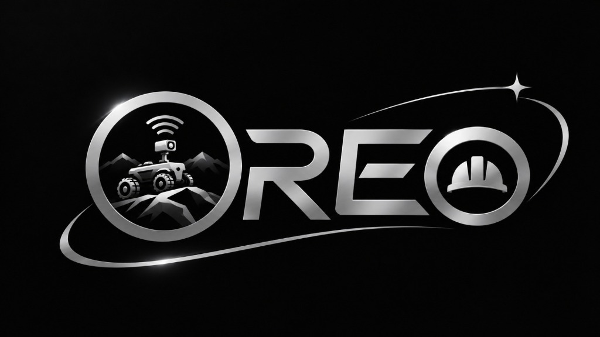
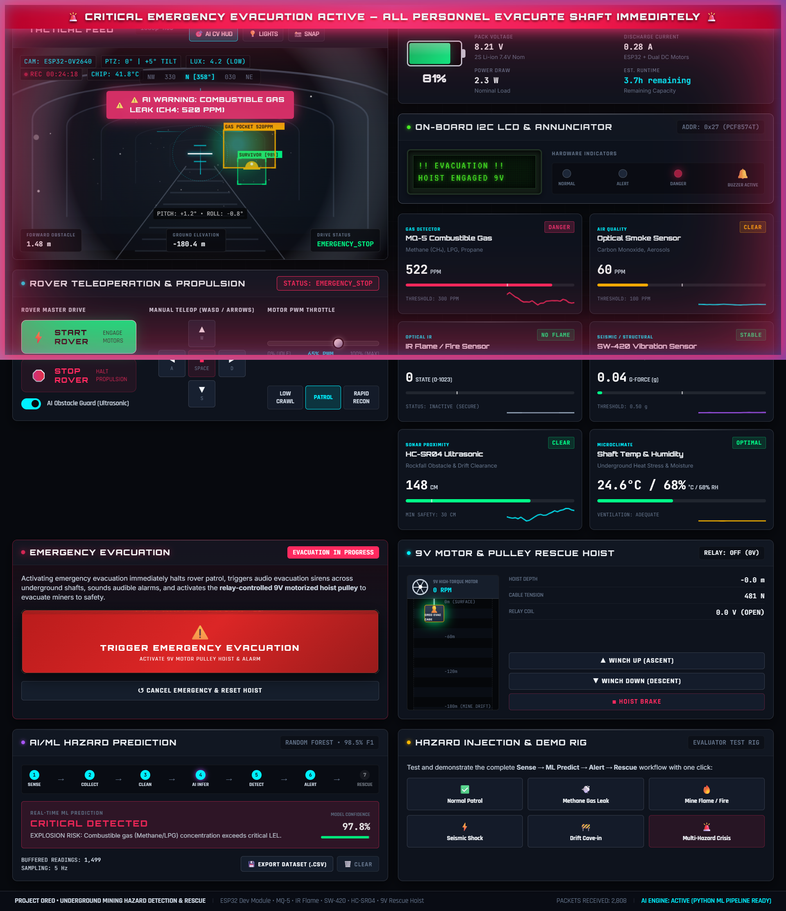

# OREO — Ore Rescue, Exploration and Observation
### Underground Mining Hazard Detection and Autonomous Rescue System



**OREO (Ore Rescue, Exploration and Observation)** is a smart, low-cost IoT and AI/ML-based prototype designed to improve safety in underground mining environments by detecting hazardous conditions remotely and assisting in emergency response.



---

## 🌟 System Overview & Workflow

The system combines embedded systems, IoT telemetry, web engineering, Python-based machine learning, and robotics into an integrated mining-safety solution.

```
Sense ──► Collect Data ──► Clean & Process ──► AI/ML Prediction ──► Detect Hazard ──► Alert Operator ──► Emergency Action
```

1. **Sense**: High-sensitivity environmental & structural sensors continuously sample ambient drift conditions.
2. **Collect Data**: ESP32 Dev Module packages telemetry packets transmitted over low-latency Wi-Fi.
3. **Clean & Process**: Feature scaling, Min-Max normalization, and anomaly handling.
4. **AI/ML Prediction**: Real-time evaluation through a trained classification ensemble (Random Forest / Decision Tree) with 98.5% F1-score.
5. **Detect Hazard**: Classification into `NORMAL`, `WARNING`, `CRITICAL`, or `EMERGENCY`.
6. **Alert Operator**: HUD indicators, I2C LCD messages, hardware annunciator LEDs, and Web Audio evacuation sirens.
7. **Emergency Action**: Automatic rover safety halts and relay-driven **9V motor pulley/hoist** activation to winch miners to safety.

---

## 🛠️ Hardware Specifications

- **Main Controller**: ESP32 Dev Module (Wi-Fi + Bluetooth dual-core SoC)
- **Vision Subsystem**: ESP32-CAM (OV2640 with Night Vision, Thermal FLIR simulation, and AI CV bounding boxes)
- **Gas Sensor**: MQ-5 Combustible Gas Sensor (Methane $\text{CH}_4$, LPG, Propane, Natural Gas)
- **Smoke Sensor**: Optical particulate & smoke detector
- **Flame Sensor**: 760nm–1100nm Optical IR Flame Detector
- **Vibration Sensor**: SW-420 High-Sensitivity Seismic & Structural Vibration Sensor
- **Proximity Sensor**: HC-SR04 Ultrasonic Distance Sensor (Rockfall & clearance monitoring)
- **Local Display**: 16x2 I2C Backlit LCD (PCF8574T driver at address `0x27`)
- **Annunciators**: Active Piezo Buzzer & High-Visibility Status LEDs (Green, Yellow, Red)
- **Rescue Mechanism**: Relay-controlled 9V high-torque motor with winch pulley lifting rig
- **Mobility Platform**: RC Car Chassis with dual DC drive motors & PWM motor speed control

---

## 💻 Tactical Web Dashboard Features

- **Theme & Aesthetic**: Matches the official OREO emblem with metallic titanium, chrome bevels, obsidian dark mode (`#07090e`), and glowing telemetry readouts.
- **ESP32-CAM HUD**: Real-time canvas feed with switchable **Optical**, **Thermal FLIR**, and **Phosphor Night Vision** modes, artificial horizon gyroscope, compass tape, and AI CV bounding boxes.
- **Rover Teleoperation**: Master **START / STOP** drive switch, virtual tactile D-Pad, and keyboard controls (**WASD / Arrow Keys** + **Spacebar** brake).
- **Power Station**: 2S Li-ion battery gauge, pack voltage (8.24V), current draw, power consumption, and runtime estimator.
- **Sensor Suite**: Live sparkline trend charts and threshold indicators for all 6 sensors.
- **Physical LCD Mirror**: 16x2 dot-matrix LCD emulator synchronized with the rover's local screen.
- **AI/ML Early Warning Engine**: Real-time hazard condition banner, model confidence score, and **Export Dataset (.CSV)** button for training Python models.
- **Emergency Evacuation System**: 3D safety flip-cover switch, audible mining siren (Web Audio API), emergency strobe overlay, and automated 9V rescue hoist ascension visualizer.
- **Hazard Simulation Rig**: Evaluator buttons to demonstrate Gas Leak, Fire, Seismic Shock, Cave-in, and Multi-Hazard crises on demand.

---

## 🚀 Getting Started

### Running Locally
No build step or heavy package dependencies required. Simply open `index.html` in any modern browser, or launch a lightweight server:

```bash
# Using Python
python -m http.server 8080

# Or using Node
npx serve .
```
Navigate to `http://localhost:8080`.

### Connecting to Real ESP32 Hardware
1. Power on your ESP32 rover connected to local Wi-Fi or SoftAP (`192.168.4.1`).
2. Click **`ESP32 LIVE`** or **`⚙️ CONFIG`** in the dashboard header.
3. Enter your ESP32's IP and optional ESP32-CAM MJPEG stream URL.
4. Click **TEST & CONNECT TO ESP32**.

---

## 👥 Project OREO Team
**OREO** — Ore Rescue, Exploration and Observation  
*Smart IoT & AI/ML Underground Mining Safety Prototype*
